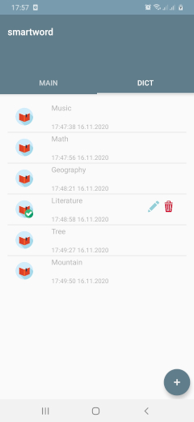
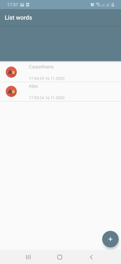

# smartword

Android application for simple study words

The purpose of the application is to simplify the study of foreign words using  
modern linguistic techniques.

In the modern world, knowledge of foreign languages is very important, therefore effective and  
quick learn of words, expressions, constructions is very in demand.

Architecture:
------------
MVC(Model View Controller)

Used Android libraries:
-----------------------
  * AppCompat
  * SQLite
  * SharedPreferences
  * JobScheduler

Used third party libraries:
--------------------------
  * Glide
  * RxJava2
  * Retrofit2
  * Gson
  * Okhttp3
  * Dagger2
  * ButterKnife
  * Timber
